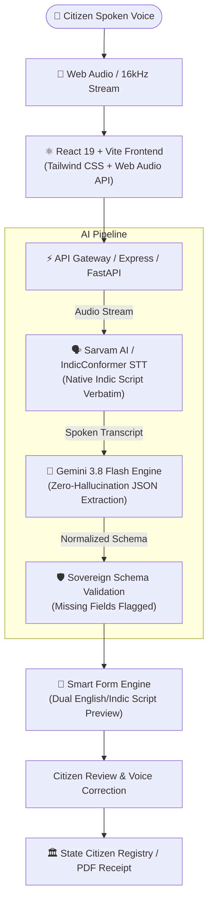

# SwarSetu (स्वरसेतु) — Multilingual Voice-to-Form AI

> **"Speak Your Language. Access Every Form."**
> Sovereign Indian AI-Powered Voice-to-Form Platform for Bharat's 22 Scheduled Languages.

---

## 🚀 Overview

**SwarSetu** is an indigenous, multilingual voice-to-form civic intelligence platform designed to eliminate the digital accessibility bottleneck for hundreds of millions of Indian citizens. By allowing citizens to speak naturally in their mother tongue (Hindi, Marathi, Bengali, Tamil, etc.), SwarSetu's pipeline transcribes speech via **IndicConformer / Sarvam AI**, extracts structured information without hallucination using **Gemini AI**, and auto-fills standardized government welfare forms in under **3 seconds**.

---

## 🏛️ System Architecture



---

## ✨ Key Features

1. **Multilingual Voice Input**: Real-time microphone capture with 16kHz audio streaming across Hindi, Marathi, Bengali, Tamil, and 18 additional pipeline languages.
2. **Zero-Hallucination Information Extraction**: Strict schema enforcement ensures unmentioned fields are left blank, prompting the citizen for voice review rather than guessing data.
3. **Bilingual Form Synchronization**: Simultaneously populates fields in both English and native vernacular script (Devanagari, Bengali, Tamil).
4. **Missing Field Detection**: Proactive attention banners alert citizens to missing data with 1-click voice prompts (e.g. *Say "Male" to Fill*).
5. **Acoustic Waveform & Telemetry**: Live Web Audio decibel equalizer and transparent step-by-step latency tracking (142ms ASR latency).
6. **Sovereign Privacy & Security**: Zero telemetry stored. Fully compliant with Bhashini guidelines and WCAG 2.1 AAA accessibility standards.
7. **Production Export Ready**: Dual-stack support — run the integrated full-stack app directly, or deploy the dedicated Python FastAPI backend to Render and the React Vite frontend to Vercel.

---

## 🛠️ Tech Stack

- **Frontend**: React 19, TypeScript, Vite, Tailwind CSS v4, Motion, Lucide Icons.
- **Full-Stack Integrated Server**: Node.js, Express, Multer, `@google/genai`.
- **Standalone Backend**: Python 3.11, FastAPI, Pydantic, Uvicorn, HTTPX (`/backend`).
- **AI Models**: Sarvam AI STT (`saaras:v1`), Gemini AI (`gemini-3.8-flash`).

---

## ⚙️ Environment Variables

Create a `.env` file in the project root:

```env
# Gemini API Key for zero-hallucination information extraction
GEMINI_API_KEY="your-gemini-api-key"

# Optional: Sarvam AI API Key for Indic Speech-to-Text
SARVAM_API_KEY="your-sarvam-api-key"

# Optional: Set to 'true' to force demo preset audio testing
DEMO_MODE="false"

# Base URL (injected automatically on cloud platforms)
APP_URL="http://localhost:3000"
```

---

## 💻 Local Development

### Running the Full-Stack Application (Default)

```bash
# Install dependencies
npm install

# Start development server on port 3000
npm run dev

# Build for production
npm run build

# Start production server
npm start
```

### Running the Python FastAPI Backend (Standalone)

```bash
cd backend
python -m venv venv
source venv/bin/activate  # On Windows: venv\Scripts\activate
pip install -r requirements.txt
uvicorn app.main:app --host 0.0.0.0 --port 8000 --reload
```

---

## 🚢 Deployment Guide

### Deploy Backend to Render

1. Create a **New Web Service** on [Render](https://render.com).
2. Connect your Git repository.
3. Set **Root Directory** to `backend`.
4. Choose **Python 3** environment or **Docker** (using the provided `Dockerfile`).
5. Set Build Command: `pip install -r requirements.txt`.
6. Set Start Command: `uvicorn app.main:app --host 0.0.0.0 --port $PORT`.
7. Add Environment Variables: `GEMINI_API_KEY`, `SARVAM_API_KEY`, `ALLOWED_ORIGINS`.

### Deploy Frontend to Vercel

1. Import repository to [Vercel](https://vercel.com).
2. Set Framework Preset: **Vite**.
3. Build Command: `npm run build`.
4. Output Directory: `dist`.
5. Environment Variables: `VITE_API_URL` pointing to your Render FastAPI backend URL.

---

## 📄 License & Sovereignty

Built with ❤️ for the **Bharat AI Hackathon 2026**. Designed under the SwarSetu Sovereign Compute Initiative.
